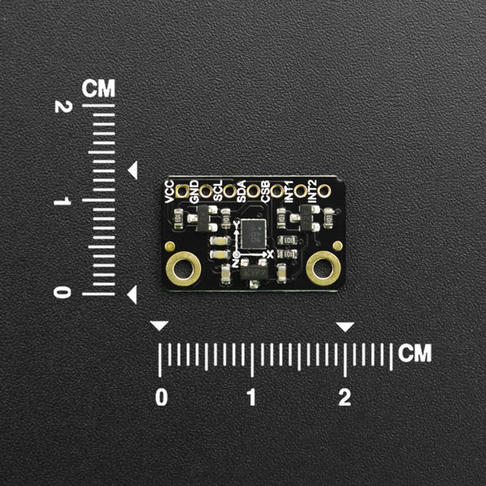

DFRobot_ES_RS485
===========================

* [English Version](./README.md)

本库提供了获取SEN0538采集数据的全部方法，用户只需要简单的使用本库就可以获取到SEN0538采集的数据。



## 产品链接（https://www.dfrobot.com）
    SKU：SEN0538
  
## 目录

  * [概述](#概述)
  * [库安装](#库安装)
  * [方法](#方法)
  * [兼容性](#兼容性)
  * [历史](#历史)
  * [创作者](#创作者)

## 概述
* 读取温湿度
* 读取空气质量
* 读取ECO2数据
* 读取TVOC数据

## 库安装

这里提供两种使用本库的方法：
1. 打开Arduino IDE,在状态栏中的Tools--->Manager Libraries 搜索"DFRobot_SHT"并安装本库.
2. 首先下载库文件,将其粘贴到\Arduino\libraries目录中,然后打开examples文件夹并在该文件夹中运行演示.

## 方法

```C++
  /**
   * @fn begin
   * @brief 本函数将会尝试与从机设备进行通信,根据返回值判断通信是否成功
   * @return 返回通信结果
   * @retval true  成功
   * @retval false 失败
   */
  bool begin(void);

  /**
   * @fn setDeviceAddress
   * @brief  修改的设备地址
   * @param  deviceAddr 待修改的设备地址
   * @return  返回修改结果
   * @retval true  成功
   * @retval false 失败
   */
  bool setDeviceAddress(uint8_t deviceAddr);

  /**
   * @fn setDeviceBaud
   * @brief  修改设备波特率
   * @param baud 待修改的波特率
   * @n     eBaud2400
   * @n     eBaud4800
   * @n     eBaud9600
   * @n     eBaud14400
   * @n     eBaud19200
   * @n     eBaud38400
   * @n     eBaud57600
   * @n     eBaud115200
   * @return  返回修改结果
   * @retval true  成功
   * @retval false 失败
   */
  bool setDeviceBaud(eSen0538Baud_t baud);

  /**
   * @fn getFirmwareVersion
   * @brief  获取固件版本
   * @return  返回  固件版本
   */
  String getFirmwareVersion();

  /**
   * @fn getVid
   * @brief  获取厂商ID
   * @return  返回  厂商ID
   */
  uint16_t getVid();

  /**
   * @fn getPid
   * @brief  获取产品ID
   * @return  返回  产品ID
   */
  uint16_t getPid();

  /**
   * @fn getTemperature
   * @brief  获取温度数据
   * @return  返回  温度数据, 单位:℃ 
   */
  float getTemperature();

  /**
   * @fn getHumidity
   * @brief  获取湿度数据
   * @return  返回  湿度数据, 单位: %RH
   */
  float getHumidity();

  /**
   * @fn getTemperatureRaw
   * @brief  获取传感器采集到的原始温度数据
   * @return  返回  原始温度数据
   */
  uint16_t getTemperatureRaw();

  /**
   * @fn getHumidityRaw
   * @brief  获取传感器采集到的原始湿度数据
   * @return  返回  原始湿度数据
   */
  uint16_t getHumidityRaw();

  /**
   * @fn getENS160Status
   * @brief 这个API获取传感器的运行状态信息
   * @return 运行状态:
   * @n        0: 正常运行;
   * @n        1: 预热阶段;
   * @n        2: 初始启动阶段;
   * @n        3: 无效的输出
   */
  uint8_t getENS160Status(void);

  /**
   * @fn getAQI
   * @brief 获取根据UBA计算出的空气质量指数
   * @return 返回值范围为: 1-5(对应优秀, 良好, 中等, 贫困, 不健康这五个等级)
   */
  uint8_t getAQI(void);

  /**
   * @fn getTVOC
   * @brief 获取总挥发性有机化合物(TVOC)的浓度
   * @return 返回值范围为: 0–65000, 单位: ppb
   */
  uint16_t getTVOC(void);

  /**
   * @fn getECO2
   * @brief 获取根据检测到的VOCs和氢报告计算出的二氧化碳当量浓度(eCO2 – Equivalent CO2)
   * @return 返回值范围为: 400–65000, 单位: ppm
   * @note 分为五个等级: Excellent(400 - 600), Good(600 - 800), Moderate(800 - 1000), 
   * @n                  Poor(1000 - 1500), Unhealthy(> 1500)
   */
  uint16_t getECO2(void);
```


## 兼容性

MCU                | Work Well    | Work Wrong   | Untested    | Remarks
------------------ | :----------: | :----------: | :---------: | :----:
Arduino Uno        |      √       |              |             |
Arduino MEGA2560   |      √       |              |             |
Arduino Leonardo   |      √       |              |             |
FireBeetle-ESP8266 |      √       |              |             |
FireBeetle-ESP32   |      √       |              |             |
FireBeetle-M0      |      √       |              |             |
Micro:bit          |              |       √      |             |

## 历史
- 2022-06-30 - 1.0.0 版本

## 创作者

Written by fary(feng.yang@dfrobot.com), 2022. (Welcome to our [website](https://www.dfrobot.com/))