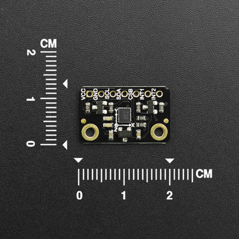

DFRobot_ES_RS485
===========================

* [English Version](./README.md)

本库提供了获取SEN0538采集数据的全部方法，用户只需要简单的使用本库就可以获取到SEN0538采集的数据。



## 产品链接（https://www.dfrobot.com）
    SKU：SEN0538
  
## 目录

  * [概述](#概述)
  * [库安装](#库安装)
  * [方法](#方法)
  * [兼容性](#兼容性)
  * [历史](#历史)
  * [创作者](#创作者)

## 概述
* 读取温湿度
* 读取空气质量
* 读取ECO2数据
* 读取TVOC数据

## 库安装

要使用库, 首先下载库文件, 将其粘贴到指定的目录中, 然后打开examples文件夹并在该文件夹中运行演示。
本库关联了modbus_tk库，使用前请确保树莓派已经下载了modbus_tk。

## 方法

```python

  def begin(self):
    '''!
      @brief 与设备进行简单的通信，确保设备在线
      @return 返回通信结果
      @retval True 设备在线并且通信成功
      @retval False 设备不在线，通信失败
    '''

  def set_device_address(self,device_addr):
    '''!
      @brief 修改设备通信地址
      @param device_addr 待修改的设备地址
      @return 返回修改结果
      @retval True 修改成功
      @retval False 修改失败
    '''

  def set_device_baud(self,baud):
    '''!
      @brief 修改设备通信波特率
      @param baud 待修改的设备通信波特率
      @return 返回修改结果
      @retval True 修改成功
      @retval False 修改失败
    '''

  def get_firmware_version(self):
    '''!
      @brief  获取固件版本
      @return  返回  固件版本
    '''

  def get_vid(self):
    '''!
      @brief  获取厂商ID
      @return  返回  厂商ID
    '''

  def get_pid(self):
    '''!
      @brief  获取产品ID
      @return  返回  产品ID
    '''

  def get_temperature(self):
    '''!
      @brief  获取温度数据
      @return  返回  温度数据, 单位:℃ 
    '''

  def get_humidity(self):
    '''!
      @brief  获取湿度数据
      @return  返回  湿度数据, 单位: %RH
    '''

  def get_temperature_raw(self):
    '''!
      @brief  获取传感器采集到的原始温度数据
      @return  返回  原始温度数据
    '''

  def get_humidity_raw(self):
    '''!
      @brief  获取传感器采集到的原始湿度数据
      @return  返回  原始湿度数据
    '''

  def get_ens160_status(self):
    '''!
      @brief 这个API获取传感器的运行状态信息
      @return 运行状态:
      @n        0: 正常运行;
      @n        1: 预热阶段;
      @n        2: 初始启动阶段;
      @n        3: 无效的输出
    '''

  def get_AQI(self):
    '''!
      @brief 获取根据UBA计算出的空气质量指数
      @return 返回值范围为: 1-5(对应优秀, 良好, 中等, 一般, 不健康这五个等级)
    '''

  def get_TVOC(self):
    '''!
      @brief 获取总挥发性有机化合物(TVOC)的浓度
      @return 返回值范围为: 0–65000, 单位: ppb
    '''

  def get_ECO2(self):
    '''!
      @brief 获取根据检测到的VOCs和氢报告计算出的二氧化碳当量浓度(eCO2 – Equivalent CO2)
      @return 返回值范围为: 400–65000, 单位: ppm
      @note 分为五个等级: Excellent(400 - 600), Good(600 - 800), Moderate(800 - 1000), 
      @n                  Poor(1000 - 1500), Unhealthy(> 1500)
    '''

  def _read_input_register(self, reg_addr ,length):
    '''!
      @brief 读取设备输入寄存器
      @param reg_addr 输入寄存器地址
      @param length 读取数据长度
      @return 读取的数据
    '''
  
  def _write_holding_register(self, reg_addr ,data):
    '''!
      @brief 向设备保持寄存器写入数据
      @param reg_addr 保持寄存器地址
      @param data 数据
      @return 写入结果
      @retval True 写入成功
      @retval False 写入失败
    '''

  def _read_holding_register(self,reg_addr,length):
    '''!
      @brief 读取设备保持寄存器
      @param reg_addr 保持寄存器地址
      @param length 读取数据长度
      @return 读取的数据
    '''
```


## 兼容性

* RaspberryPi 版本

| Board        | Work Well | Work Wrong | Untested | Remarks |
| ------------ | :-------: | :--------: | :------: | ------- |
| RaspberryPi2 |           |            |    √     |         |
| RaspberryPi3 |           |            |    √     |         |
| RaspberryPi4 |     √     |            |          |         |

* Python 版本

| Python  | Work Well | Work Wrong | Untested | Remarks |
| ------- | :-------: | :--------: | :------: | ------- |
| Python2 |     √     |            |          |         |
| Python3 |     √     |            |          |         |


## 历史
- 2022-07-14 - 1.0.0 版本

## 创作者

Written by fary(feng.yang@dfrobot.com), 2022. (Welcome to our [website](https://www.dfrobot.com/))